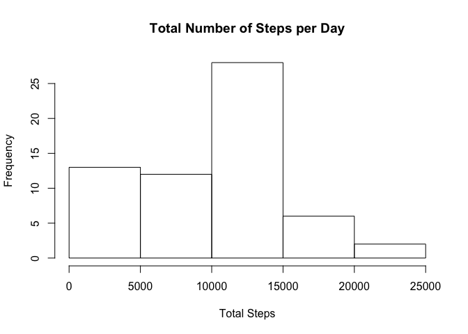
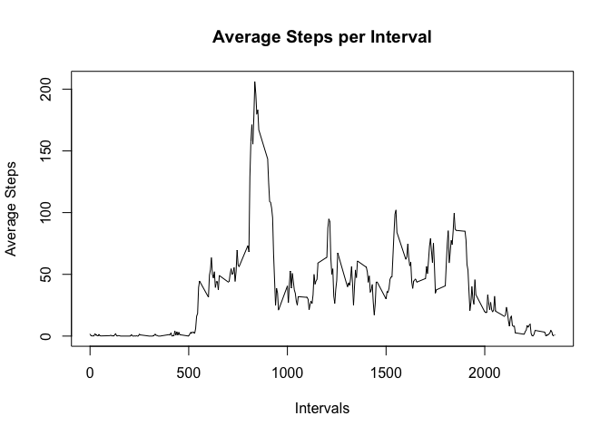
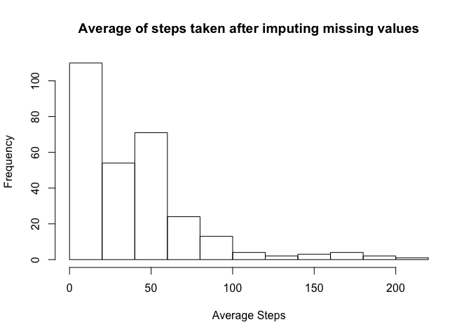
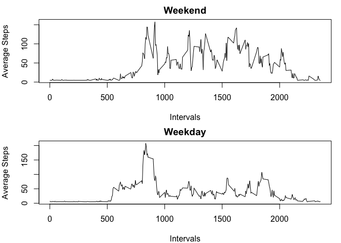

## Loading and preprocessing the data

```r
zipfilename <- "activity.zip"

if(file.exists(zipfilename)){
  unzip(zipfilename,exdir = ".",overwrite = TRUE)
}else{
  stop(paste("Error in extracting data files out of zip file",geterrmessage()))
}
```

##Read data file and format date column

```r
activity<-read.csv("activity.csv",header = TRUE)
activity[,2]<-as.Date(activity$date)
```

```
## Warning in strptime(xx, f <- "%Y-%m-%d", tz = "GMT"): unknown timezone
## 'default/America/Chicago'
```

## What is mean total number of steps taken per day?

```r
steps_sum<-with(activity,tapply(steps,date,sum,na.rm=TRUE))
hist(steps_sum,xlab = "Total Steps",ylab = "Frequency",main = "Total Number of Steps per Day")
```

<!-- -->


## What is the average daily activity pattern?
##Get Mean of steps taken each day

```r
print(mean(steps_sum))
```

```
## [1] 9354.23
```

##Get Median of steps taken each day

```r
print(median(steps_sum))
```

```
## [1] 10395
```

##Time series plot of the average number of steps taken

```r
library(dplyr)
```

```
## Warning: package 'dplyr' was built under R version 3.4.4
```

```
## 
## Attaching package: 'dplyr'
```

```
## The following objects are masked from 'package:stats':
## 
##     filter, lag
```

```
## The following objects are masked from 'package:base':
## 
##     intersect, setdiff, setequal, union
```

```r
steps_Avg <- with(activity,tapply(steps,interval,mean,na.rm=TRUE))
intervals<-unique(activity$interval)
avg_steps_by_interval<-data.frame(cbind(steps_Avg,intervals))
plot(avg_steps_by_interval$intervals,avg_steps_by_interval$steps_Avg,type = "l",xlab = "Intervals", ylab = "Average Steps",main = "Average Steps per Interval")
```

<!-- -->

##The 5 min interval that contains highest average of steps

```r
index_avg<-which.max(avg_steps_by_interval$steps_Avg)
max<-avg_steps_by_interval[index_avg,2]
print(max)
```

```
## [1] 835
```

## Imputing missing values
##get the average value to use to replace na

```r
index<-which(is.na(activity$steps))
len <- length(index)

steps_avg<-with(activity,tapply(steps,date,mean,na.rm=TRUE))

mean_value<-mean(steps_avg,na.rm = TRUE)
```

##loop through the data and replace na with mean_value

```r
for (i in 1:len) {
        activity[index[i],1]<- mean_value
}
```

##Histogram of the total number of steps taken each day after missing values are imputed

```r
steps_avg<-with(activity,tapply(steps,date,mean,na.rm=TRUE))
hist(steps_Avg, xlab="Average Steps", ylab="Frequency",main="Average of steps taken after imputing missing values")
```

<!-- -->

## Are there differences in activity patterns between weekdays and weekends?
##classify date for weekday and weekend

```r
activity$date <- as.Date(activity$date)
activity_byweekday<- mutate(activity, day = ifelse(weekdays(activity$date) == "Saturday" | weekdays(activity$date) == "Sunday", "weekend", "weekday"))
```


##subset by weekend or week day

```r
activity_weekend<-subset(activity_byweekday,as.character(activity_byweekday$day)=="weekend")
activity_weekday<-subset(activity_byweekday,as.character(activity_byweekday$day)=="weekday")

str(activity_weekend)
```

```
## 'data.frame':	4608 obs. of  4 variables:
##  $ steps   : num  0 0 0 0 0 0 0 0 0 0 ...
##  $ date    : Date, format: "2012-10-06" "2012-10-06" ...
##  $ interval: int  0 5 10 15 20 25 30 35 40 45 ...
##  $ day     : chr  "weekend" "weekend" "weekend" "weekend" ...
```

##view modified activity for weekday

```r
str(activity_weekday)
```

```
## 'data.frame':	12960 obs. of  4 variables:
##  $ steps   : num  37.4 37.4 37.4 37.4 37.4 ...
##  $ date    : Date, format: "2012-10-01" "2012-10-01" ...
##  $ interval: int  0 5 10 15 20 25 30 35 40 45 ...
##  $ day     : chr  "weekday" "weekday" "weekday" "weekday" ...
```

##calculate means for week day and week ends

```r
steps_weekend<-with(activity_weekend,tapply(steps,interval,mean,na.rm=TRUE))
steps_weekday<-with(activity_weekday,tapply(steps,interval,mean,na.rm=TRUE))

interval_weekend<-unique(activity_weekend$interval)
interval_weekday<-unique(activity_weekday$interval)

Final_activity__weekend<-data.frame(cbind(steps_weekend,interval_weekend))
Final_activity_weekday<-data.frame(cbind(steps_weekday,interval_weekday))
```


##plot weekday & week end graph

```r
par(mfrow=c(2,1),mar=c(4,4,2,1))
plot(Final_activity__weekend$interval_weekend,Final_activity__weekend$steps_weekend,type = "l",xlab = "Intervals", ylab = "Average Steps",main = "Weekend")
plot(Final_activity_weekday$interval_weekday,Final_activity_weekday$steps_weekday,type = "l",xlab = "Intervals",
     ylab = "Average Steps",main = "Weekday")
```

<!-- -->

##Conclusion: Weekend has more activity
